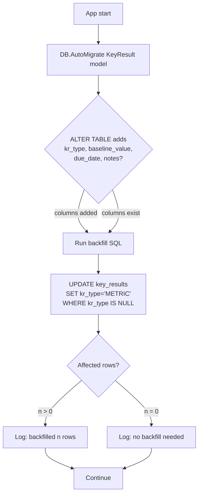
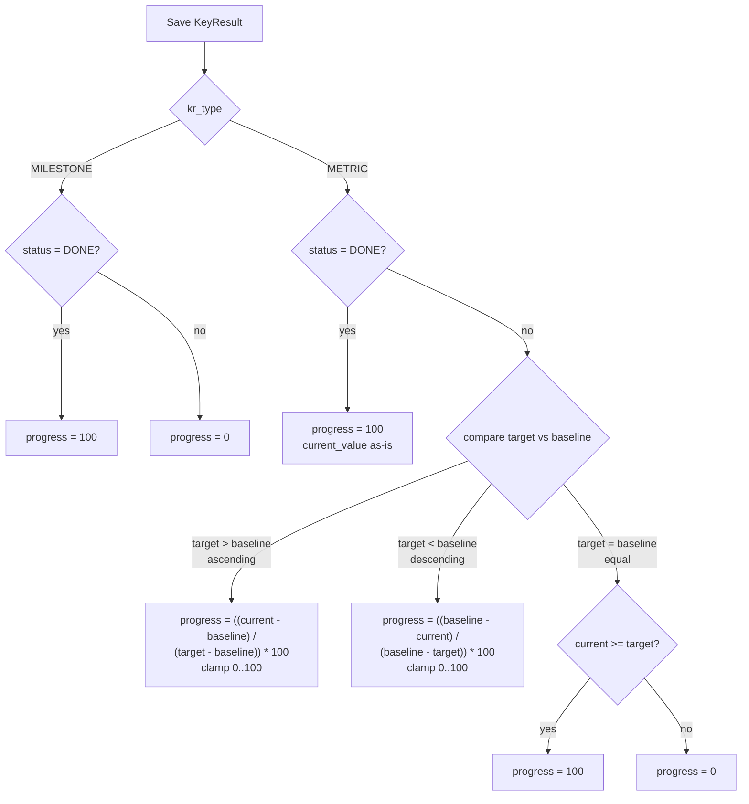

# Design Document

## Overview

Fitur ini menambahkan dukungan dua tipe Key Result (METRIC dan MILESTONE) pada modul `keyresult` existing di backend Go (Gin + GORM + MySQL) dan komponen `KeyResultPanel`/list KR pada frontend React. Perubahan bersifat additive: kolom baru pada tabel `key_results` (semua nullable), endpoint baru `PATCH /api/key-results/:id/toggle-milestone`, dan field baru pada DTO request/response. Endpoint create/update existing tetap kompatibel dengan client lama (default `kr_type = 'METRIC'`, `baseline_value = 0`, `due_date = NULL`, `notes = NULL`).

Perubahan inti:

- **Schema**: tambah `kr_type VARCHAR(20)`, `baseline_value DECIMAL(10,2)`, `due_date DATE`, `notes TEXT` ke `key_results` (nullable). Migration backfill `kr_type = 'METRIC'` untuk record lama.
- **Service**: progress calculator dipecah jadi `calcMetricProgress` (baseline-aware, ascending/descending/equal) dan `calcMilestoneProgress` (binary 0/100 dari status). Service mengabaikan numeric recalc untuk MILESTONE_KR.
- **DTO**: tambah `PatchableFloat` dan `PatchableDate` di `keyresult/dto.go` dengan semantik sama seperti `PatchableUint`/`PatchableString` existing (membedakan absent vs null).
- **Endpoint**: `PATCH /api/key-results/:id/toggle-milestone` flip `status` (DONE ↔ ON_TRACK) untuk MILESTONE_KR creator-only, dan recompute `progress`.
- **Activity Log**: delta diff hanya menyertakan field yang berubah (`kr_type`, `baseline_value`, `due_date`, `notes`) di `old_value`/`new_value`.
- **Frontend**: radio Type di top form, conditional fields, Notes textarea selalu tampil dengan character counter; KR card visualization differs per type; optional `KeyResult_Filter` dropdown.

Tidak ada perubahan business rule existing: cascade delete, ownership (creator-only edit/delete), dan progress chain dari Initiative ke Objective tetap berjalan apa adanya.

## Architecture

### Module Layout (no module restructuring)

```
backend/internal/modules/keyresult/
├── model.go         (extend KeyResult struct: KRType, BaselineValue, DueDate, Notes)
├── dto.go           (add PatchableFloat, PatchableDate; extend Create/UpdateRequest, KeyResultResponse)
├── repository.go    (no schema-level change; add UpdateFields helper for partial save)
├── service.go       (split progress calc; add ToggleMilestone; type-aware validation)
└── handler.go       (add ToggleMilestone handler)

backend/internal/database/
└── migration.go     (call AutoMigrate; add backfill SQL for kr_type IS NULL)

frontend/src/
├── types/index.ts                              (extend KeyResult interface)
├── services/keyResult.service.ts               (add toggleMilestone)
└── components/organisms/KeyResultPanel.tsx     (radio Type + conditional fields + Notes)
└── components/organisms/KeyResultCard.tsx      (NEW — visualization per type, also can stay in panel parent)
└── components/atomics/KeyResultTypeFilter.tsx  (NEW — optional dropdown)
```

### Request Flow — Create / Update KR

```mermaid
sequenceDiagram
    participant FE as KeyResult_Form
    participant H as keyresult.Handler
    participant S as keyresult.Service
    participant V as Validator (per kr_type)
    participant R as keyresult.Repository
    participant AL as activitylog.Service
    participant DB as MySQL

    FE->>H: POST /objectives/:id/key-results { kr_type, ...fields }
    H->>H: ShouldBindJSON → CreateRequest
    H->>S: Create(objectiveID, req, userID)
    S->>V: validateByType(kr_type, req)
    alt kr_type = METRIC
        V->>V: target_value > 0; current/baseline >= 0
    else kr_type = MILESTONE
        V->>V: due_date matches YYYY-MM-DD or null
    end
    S->>S: progress = calcProgress(kr_type, ...)
    S->>R: Create(KeyResult)
    R->>DB: INSERT key_results
    DB-->>R: id
    S-->>H: KeyResultResponse
    H->>AL: Log(CREATE, KEY_RESULT, id, title, NewValue=delta)
    AL->>DB: INSERT activity_logs
    H-->>FE: 201 { data: response }
```

### Toggle Milestone Flow

```mermaid
sequenceDiagram
    participant FE as KeyResult_Card
    participant H as keyresult.Handler
    participant S as keyresult.Service
    participant R as keyresult.Repository
    participant AL as activitylog.Service

    FE->>H: PATCH /key-results/:id/toggle-milestone
    H->>S: ToggleMilestone(id, userID)
    S->>R: FindByID(id)
    R-->>S: kr
    alt kr.KRType != MILESTONE
        S-->>H: error "not a milestone KR"
        H-->>FE: 422 { message }
    else kr.CreatedBy != userID
        S-->>H: error "forbidden"
        H-->>FE: 403 { message }
    else
        S->>S: oldStatus = kr.Status; oldProgress = kr.Progress
        alt oldStatus = DONE
            S->>S: kr.Status = ON_TRACK; kr.Progress = 0
        else
            S->>S: kr.Status = DONE; kr.Progress = 100
        end
        S->>R: Update(kr) [TX]
        S-->>H: response
        H->>AL: Log(STATUS_CHANGE, KEY_RESULT, id, title, Old={status,progress}, New={status,progress})
        H-->>FE: 200 { data: response }
    end
```

### Migration & Backfill



The backfill SQL is idempotent: running it on an already-migrated database is a no-op (zero affected rows). Wrapped in a `db.Exec` call inside `migration.go` after `AutoMigrate` returns successfully.

### Progress Calculation Decision Tree



## Components and Interfaces

### Backend

#### `keyresult.KeyResult` (model.go)

Extend the existing struct:

```go
type KeyResult struct {
    // ... existing fields ...
    KRType        *string  `gorm:"size:20" json:"kr_type"`               // NULL means legacy METRIC
    BaselineValue *float64 `gorm:"type:decimal(10,2);default:0" json:"baseline_value"`
    DueDate       *string  `gorm:"type:date" json:"due_date"`            // YYYY-MM-DD
    Notes         *string  `gorm:"type:text" json:"notes"`
}

const (
    KRTypeMetric    = "METRIC"
    KRTypeMilestone = "MILESTONE"
)

// Helper: returns effective type, treating NULL as METRIC (backward compat).
func (k *KeyResult) EffectiveType() string {
    if k.KRType == nil || *k.KRType == "" {
        return KRTypeMetric
    }
    return *k.KRType
}
```

`DueDate` is stored as string `YYYY-MM-DD` (parsed at boundary). Using `*time.Time` would force ISO datetime serialization with timezone shifts; since DATE has no time component, string-typed pointer keeps the contract clean both for JSON and SQL.

#### `keyresult/dto.go` — Patchable helpers

Add `PatchableFloat` and `PatchableDate` mirroring the pattern of `PatchableUint` / `PatchableString` from `objective/dto.go`. They are kept local to the keyresult package to avoid premature abstraction; if a third module needs them, they can move to `internal/shared/patch/`.

```go
type PatchableFloat struct {
    Present bool
    Value   *float64
}

func (p *PatchableFloat) UnmarshalJSON(data []byte) error {
    p.Present = true
    if bytes.Equal(bytes.TrimSpace(data), []byte("null")) {
        p.Value = nil; return nil
    }
    var v float64
    if err := json.Unmarshal(data, &v); err != nil { return err }
    p.Value = &v
    return nil
}

type PatchableDate struct {
    Present bool
    Value   *string // canonicalized to YYYY-MM-DD or nil
}

func (p *PatchableDate) UnmarshalJSON(data []byte) error {
    p.Present = true
    if bytes.Equal(bytes.TrimSpace(data), []byte("null")) {
        p.Value = nil; return nil
    }
    var v string
    if err := json.Unmarshal(data, &v); err != nil { return err }
    if _, err := time.Parse("2006-01-02", v); err != nil {
        return fmt.Errorf("due_date must be YYYY-MM-DD")
    }
    p.Value = &v
    return nil
}
```

#### `CreateRequest` / `UpdateRequest`

```go
type CreateRequest struct {
    Title         string   `json:"title" binding:"required,max=255"`
    Description   string   `json:"description" binding:"max=1000"`
    KRType        string   `json:"kr_type"`                              // optional, default METRIC
    TargetValue   *float64 `json:"target_value"`                         // required for METRIC
    CurrentValue  *float64 `json:"current_value"`                        // optional, default 0
    BaselineValue *float64 `json:"baseline_value"`                       // optional, default 0
    MetricUnit    string   `json:"metric_unit" binding:"max=50"`
    DueDate       *string  `json:"due_date"`                             // YYYY-MM-DD or null
    Notes         *string  `json:"notes" binding:"omitempty,max=5000"`
    Status        string   `json:"status"`                               // optional
}

type UpdateRequest struct {
    Title         *string         `json:"title" binding:"omitempty,max=255"`
    Description   *string         `json:"description" binding:"omitempty,max=1000"`
    KRType        *string         `json:"kr_type"`                       // METRIC or MILESTONE, never null
    TargetValue   PatchableFloat  `json:"target_value"`
    CurrentValue  PatchableFloat  `json:"current_value"`
    BaselineValue PatchableFloat  `json:"baseline_value"`                // null → 0
    MetricUnit    PatchableString `json:"metric_unit"`
    DueDate       PatchableDate   `json:"due_date"`                      // null → NULL
    Notes         PatchableString `json:"notes"`                         // null → NULL
    Status        *string         `json:"status"`
}
```

`KRType` is a `*string` (not a Patchable) because criterion 3.4 requires rejecting `kr_type: null` with HTTP 400. The custom `UnmarshalJSON` for the field rejects `null` explicitly; absent key → `nil` (no change).

#### `keyresult.Service` — public methods

```go
// existing
func (s *Service) Create(objectiveID uint, req CreateRequest, userID uint) (*KeyResultResponse, error)
func (s *Service) Update(id uint, req UpdateRequest, userID uint) (*KeyResultResponse, *ChangeSet, error)
func (s *Service) Delete(id uint, userID uint) error
func (s *Service) GetByObjectiveID(objectiveID uint) ([]KeyResultResponse, error)

// new
func (s *Service) ToggleMilestone(id uint, userID uint) (*KeyResultResponse, *ChangeSet, error)

// internal
func calcMetricProgress(target, baseline, current float64) float64
func calcMilestoneProgress(status string) float64
func validateMetricFields(target, current, baseline *float64, isCreate bool) map[string]string
func validateDueDate(s *string) error
func validateNotes(s *string) error
```

`ChangeSet` is a small struct returned by `Update` and `ToggleMilestone` so the handler can build delta old/new value JSON for activity log without re-fetching.

```go
type ChangeSet struct {
    OldFields map[string]any
    NewFields map[string]any
}
```

The Update method:

1. Loads existing KR; checks ownership (403 if `created_by != userID`).
2. Determines `nextType` = `req.KRType` if set else `kr.EffectiveType()`.
3. Validates fields by `nextType` (e.g., if switching to METRIC, target_value must be > 0 either from existing or from request).
4. Applies absent/present/null semantics (PatchableXxx) to mutate `kr` fields.
5. Recomputes `progress` via `calcMetricProgress` or `calcMilestoneProgress`.
6. Builds `ChangeSet` only for `kr_type`, `baseline_value`, `due_date`, `notes` that actually differ (Requirement 7.2-7.3).
7. Saves and returns response.

The progress recalc trigger from initiative changes (existing `ProgressService`) consults `kr.EffectiveType()`: for MILESTONE it skips numeric updates; for METRIC it derives `current_value` from average root initiative progress (existing formula adapted to `baseline + (avg/100) * (target - baseline)`).

#### `keyresult.Handler` — new endpoint

```go
func (h *Handler) ToggleMilestone(c *gin.Context) {
    id, _ := strconv.ParseUint(c.Param("id"), 10, 32)
    userID := c.GetUint("user_id")

    kr, cs, err := h.service.ToggleMilestone(uint(id), userID)
    switch {
    case errors.Is(err, ErrNotFound):
        response.Error(c, 404, "Key result not found", nil); return
    case errors.Is(err, ErrForbidden):
        response.Error(c, 403, "Anda tidak punya izin untuk mengubah milestone ini", nil); return
    case errors.Is(err, ErrNotMilestone):
        response.Error(c, 422, "Cannot toggle milestone on METRIC key result", nil); return
    case err != nil:
        response.Error(c, 500, "Failed to toggle milestone", nil); return
    }

    h.actLogger.Log(userID, activitylog.ActionStatusChange, activitylog.EntityKeyResult, kr.ID, kr.Title,
        activitylog.WithObjectiveID(kr.ObjectiveID),
        activitylog.WithKeyResultID(kr.ID),
        activitylog.WithOldValue(jsonString(cs.OldFields)),
        activitylog.WithNewValue(jsonString(cs.NewFields)))

    response.Success(c, 200, "Milestone toggled", kr)
}
```

Routing in `cmd/api/main.go` (or wherever routes are wired):

```go
api.PATCH("/key-results/:id/toggle-milestone", authMiddleware, krHandler.ToggleMilestone)
```

#### Activity Log — delta diff

In `service.Update`, build the delta diff for the four new fields:

```go
oldDelta := map[string]any{}
newDelta := map[string]any{}
if req.KRType != nil && *req.KRType != kr.EffectiveType() {
    oldDelta["kr_type"] = kr.EffectiveType()
    newDelta["kr_type"] = *req.KRType
}
if req.BaselineValue.Present {
    nv := 0.0
    if req.BaselineValue.Value != nil { nv = *req.BaselineValue.Value }
    if !floatEq(nv, deref(kr.BaselineValue, 0)) {
        oldDelta["baseline_value"] = deref(kr.BaselineValue, 0)
        newDelta["baseline_value"] = nv
    }
}
// similar for due_date, notes
```

Existing fields that change (title, description, status, target_value, current_value, metric_unit) keep using the existing logger pattern; the delta map is merged with whatever the existing UPDATE log already includes.

### Frontend

#### TypeScript types (`src/types/index.ts`)

```ts
export type KRType = 'METRIC' | 'MILESTONE';

export interface KeyResult {
  id: number;
  objective_id: number;
  title: string;
  description: string | null;
  kr_type: KRType;                        // NEW
  target_value: number;
  current_value: number;
  baseline_value: number;                 // NEW (default 0 if backend NULL)
  metric_unit: string | null;
  due_date: string | null;                // NEW, YYYY-MM-DD
  notes: string | null;                   // NEW
  progress: number;
  confidence_level: number;
  status: string;
  created_by: number;
  created_at: string;
  updated_at: string;
}
```

Backend `ToKeyResultResponse` normalizes NULL `kr_type` → `'METRIC'` and NULL `baseline_value` → `0` so the frontend can rely on these fields being present.

#### `KeyResultPanel.tsx` — form structure

Form layout (top → bottom):

1. **Title** (always)
2. **Description** (always)
3. **Type** radio group — `METRIC` (default for create) / `MILESTONE`
4. *Conditional METRIC block*: Baseline / Target / Current (grid 3-col), Metric Unit
5. *Conditional MILESTONE block*: Due Date (date picker), Selesai checkbox (binds `status = 'DONE'`)
6. **Confidence Level** slider (always)
7. **Notes** textarea with `{used}/5000` counter (always)
8. Footer: Hapus (edit only) / Simpan

Form state via `react-hook-form` keeps all field values regardless of the selected type — switching radio only toggles visibility (not unmounting), so previously typed values persist (Requirement 9.7). Submit handler picks fields based on `watch('kr_type')`:

```ts
const krType = watch('kr_type');
const onSubmit = (data: FormData) => {
  const payload: any = {
    title: data.title.trim(),
    description: data.description.trim() || null,
    kr_type: data.kr_type,
    confidence_level: data.confidence_level,
    notes: data.notes.trim() || null,
  };
  if (data.kr_type === 'METRIC') {
    payload.target_value = Number(data.target_value);
    payload.current_value = Number(data.current_value || 0);
    payload.baseline_value = Number(data.baseline_value || 0);
    payload.metric_unit = data.metric_unit.trim() || null;
  } else {
    payload.due_date = data.due_date || null;
    payload.status = data.done ? 'DONE' : (isEdit ? keyResult!.status : 'PLANNING');
  }
  saveMutation.mutate(payload);
};
```

Notes character counter is computed client-side; if length > 5000, Simpan button disabled (Requirement 9.9).

#### KeyResult card visualization

The KR card lives in the parent component that lists KRs (currently inline in `ObjectivesPage` / panel). Branch on `kr.kr_type`:

- **METRIC**: progress bar (8px height, primary color), label `{current}/{target} {metric_unit?}`, and if `baseline_value > 0` extra label `from {baseline} → {target}, now {current}`.
- **MILESTONE**: checkbox icon (filled-green if `status='DONE'`, outline-gray otherwise), title to the right. Sub-label depends on due date:
  - `status='DONE'` → `Completed` (green `#065F46`)
  - `due_date=null` → `No due date` (gray `#6B7280`)
  - `due_date < today AND status != 'DONE'` → `Overdue {N} days` (red `#991B1B`)
  - `due_date >= today` → `Due in {N} days`

Day delta computed in client local timezone using `Math.ceil` between today (00:00) and due date.

#### `KeyResult_Filter` (optional)

Atomic-level dropdown:

```tsx
type Filter = 'ALL' | 'METRIC' | 'MILESTONE';
<Dropdown
  options={[
    { value: 'ALL', label: 'All Types' },
    { value: 'METRIC', label: 'Metric Only' },
    { value: 'MILESTONE', label: 'Milestone Only' },
  ]}
  value={filter}
  onChange={setFilter}
/>
```

Applied client-side: `keyResults.filter(kr => filter === 'ALL' || kr.kr_type === filter)`. Empty state shows `Tidak ada key result dengan tipe yang dipilih` (Requirement 12.5).

#### Quick toggle on card

```ts
const toggle = useMutation({
  mutationFn: () => keyResultService.toggleMilestone(kr.id),
  onMutate: async () => {
    const prev = queryClient.getQueryData(['key-results', kr.objective_id]);
    queryClient.setQueryData(['key-results', kr.objective_id], (old: any) =>
      old?.map((k: KeyResult) => k.id === kr.id
        ? { ...k, status: k.status === 'DONE' ? 'ON_TRACK' : 'DONE',
              progress: k.status === 'DONE' ? 0 : 100 }
        : k));
    return { prev };
  },
  onError: (err: any, _v, ctx) => {
    queryClient.setQueryData(['key-results', kr.objective_id], ctx?.prev);
    toast.error(err.response?.data?.message || 'Gagal mengubah milestone');
  },
  onSettled: () => queryClient.invalidateQueries({ queryKey: ['key-results'] }),
});
```

Pre-flight check: if `currentUser.id !== kr.created_by`, skip the mutation and show toast `Anda tidak punya izin untuk mengubah milestone ini` (Requirement 11.5).

## Data Models

### Schema delta — `key_results`

```sql
ALTER TABLE key_results
  ADD COLUMN kr_type VARCHAR(20) NULL,
  ADD COLUMN baseline_value DECIMAL(10,2) NULL DEFAULT 0,
  ADD COLUMN due_date DATE NULL,
  ADD COLUMN notes TEXT NULL;

-- Backfill (idempotent): only touches NULL rows.
UPDATE key_results SET kr_type = 'METRIC' WHERE kr_type IS NULL;
```

GORM AutoMigrate produces the ALTER above from the model tags; the backfill is run explicitly in `migration.go` after AutoMigrate returns. No CHECK constraint on `kr_type` — validation lives in the service layer to keep the column nullable for legacy rows and avoid migration order issues. App-level invariant: every newly-saved row must have `kr_type IN ('METRIC','MILESTONE')`.

### KR_Type domain

```
KRType ∈ { METRIC, MILESTONE }
```

Treated as case-sensitive at the API boundary. Any other value at create/update returns 400 with `errors.kr_type`.

### Updated `KeyResultResponse` shape

```json
{
  "id": 123,
  "objective_id": 45,
  "title": "Reduce churn rate",
  "description": "Quarterly churn reduction",
  "kr_type": "METRIC",
  "target_value": 5.0,
  "current_value": 8.5,
  "baseline_value": 10.0,
  "metric_unit": "%",
  "due_date": null,
  "notes": "Track weekly via dashboard",
  "progress": 30.0,
  "confidence_level": 7,
  "status": "ON_TRACK",
  "created_by": 1,
  "created_at": "2026-04-01T08:00:00Z",
  "updated_at": "2026-04-15T10:30:00Z"
}
```

For MILESTONE_KR:

```json
{
  "id": 124,
  "objective_id": 45,
  "title": "Launch v2 API",
  "kr_type": "MILESTONE",
  "target_value": 100.0,        // preserved if previously set; not used in calc
  "current_value": 0.0,
  "baseline_value": 0.0,
  "metric_unit": null,
  "due_date": "2026-06-30",
  "notes": null,
  "progress": 0.0,
  "status": "PLANNING"
}
```

### Activity Log payload shape

`old_value` / `new_value` JSON only contain fields that actually changed (delta). Example for a PATCH that flips `kr_type` and updates `notes`:

```json
{
  "old_value": "{\"kr_type\":\"METRIC\",\"notes\":null}",
  "new_value": "{\"kr_type\":\"MILESTONE\",\"notes\":\"due Q3\"}"
}
```

For toggle-milestone:

```json
{
  "old_value": "{\"status\":\"ON_TRACK\",\"progress\":0}",
  "new_value": "{\"status\":\"DONE\",\"progress\":100}"
}
```

### Progress formulas (canonical)

Let `t = target_value`, `b = baseline_value`, `c = current_value`. Define `clamp(x) = max(0, min(100, x))`.

```
METRIC progress (status != DONE):
  if t > b:   ((c - b) / (t - b)) * 100, clamped
  if t < b:   ((b - c) / (b - t)) * 100, clamped
  if t == b:  100 if c >= t else 0

MILESTONE progress:
  100 if status == 'DONE' else 0

Either type, status == 'DONE': progress = 100 (overrides numeric).
```

Rounded to 2 decimals (half-up) before persisting to `DECIMAL(5,2)`.


## Correctness Properties

*A property is a characteristic or behavior that should hold true across all valid executions of a system — essentially, a formal statement about what the system should do. Properties serve as the bridge between human-readable specifications and machine-verifiable correctness guarantees.*

The following properties were derived from the acceptance criteria via the prework analysis. After consolidation, eleven universal properties cover the testable rules of this feature; UI rendering rules and one-time schema checks remain as example/smoke tests (see Testing Strategy).

### Property 1: METRIC progress formula correctness

*For any* triple `(target, baseline, current)` with `target, baseline, current ≥ 0` and a METRIC_KR whose `status != 'DONE'`, the computed progress equals the canonical piecewise formula clamped to `[0, 100]` and rounded half-up to 2 decimals:

- if `target > baseline`: `round(clamp(((current - baseline) / (target - baseline)) * 100), 2)`
- if `target < baseline`: `round(clamp(((baseline - current) / (baseline - target)) * 100), 2)`
- if `target == baseline`: `100` if `current >= target`, else `0`

**Validates: Requirements 4.1, 4.2, 4.3, 4.4, 4.5, 4.6**

### Property 2: METRIC status=DONE overrides numeric progress

*For any* METRIC_KR with arbitrary `(target, baseline, current)`, when persisted with `status = 'DONE'` the resulting `progress` equals `100` and `current_value` is unchanged from its input value; when persisted with any other status the resulting `progress` equals the formula in Property 1.

**Validates: Requirements 4.8, 4.9**

### Property 3: MILESTONE progress is binary based on status

*For any* MILESTONE_KR with arbitrary numeric fields (`target_value`, `current_value`, `baseline_value`) and arbitrary descendant initiative tree, the persisted `progress` equals `100` if `status = 'DONE'` and `0` otherwise; the numeric fields and progress chain inputs do not influence the result.

**Validates: Requirements 5.1, 5.2, 5.3, 5.7, 5.8**

### Property 4: Toggle-milestone is involutive

*For any* MILESTONE_KR with any initial `(status, progress)` pair, calling `ToggleMilestone` twice in succession returns the record to its original `(status, progress)` state. A single call flips the boolean dimension: `DONE` ↔ `ON_TRACK` for `status` and `100` ↔ `0` for `progress`.

**Validates: Requirements 5.4**

### Property 5: Toggle-milestone rejects non-MILESTONE KRs

*For any* METRIC_KR (or any KR where `EffectiveType() != 'MILESTONE'`), the endpoint `PATCH /api/key-results/:id/toggle-milestone` returns HTTP 422 and the persisted record (all columns) is byte-identical before and after the call.

**Validates: Requirements 5.5**

### Property 6: Type switching preserves data

*For any* KR record `R` and any valid `nextType ∈ {METRIC, MILESTONE}`, a PATCH that changes `kr_type` from `R.kr_type` to `nextType` (without sending other field updates) preserves `target_value`, `current_value`, `baseline_value`, `metric_unit`, `due_date`, and `notes` unchanged; only `kr_type` and `progress` change. The new `progress` matches Property 1/2 (METRIC) or Property 3 (MILESTONE) for `nextType`.

**Validates: Requirements 6.1, 6.2**

### Property 7: PATCH absent-vs-null semantics for new fields

*For any* pre-state KR `R` and any valid PATCH payload `P`, after the update the post-state `R'` satisfies the following per-field rules for each `f ∈ {kr_type, baseline_value, due_date, notes}`:

- `f` absent in `P` → `R'.f == R.f`
- `f` present with explicit `null` in `P` → `R'.f` equals the per-field null target: `baseline_value → 0`, `due_date → NULL`, `notes → NULL`. (`kr_type = null` is rejected — see Property 8.)
- `f` present with value `v` in `P` → `R'.f == v` (round-trip echo)

**Validates: Requirements 3.1, 3.2, 3.3, 3.8, 3.9, 3.10, 3.12, 3.13**

### Property 8: Validation rejects invalid inputs without DB write

*For any* payload that violates at least one of the following rules, the API returns HTTP 400 with a non-empty `errors` map and the database state for `key_results` and `activity_logs` is byte-identical before and after the call:

- `kr_type` ∉ `{METRIC, MILESTONE}` (case-sensitive) on create or update
- `kr_type = null` on PATCH
- METRIC `target_value` absent (on create) or `<= 0`
- METRIC `current_value` or `baseline_value` `< 0`
- `due_date` non-null with format not matching `YYYY-MM-DD` or representing an invalid calendar date
- `notes` length `> 5000` characters

**Validates: Requirements 2.3, 2.5, 2.6, 2.8, 2.9, 3.4, 3.5, 3.6, 3.7, 3.11, 3.14**

### Property 9: kr_type defaulting and backward compatibility

*For any* create payload that omits `kr_type`, the persisted record has `kr_type = 'METRIC'`, `baseline_value = 0`, `due_date = NULL`, `notes = NULL`. *For any* read of a row stored with `kr_type IS NULL` (legacy data), `EffectiveType()` returns `'METRIC'` and downstream progress calculation uses the METRIC formula with `baseline = 0`.

**Validates: Requirements 1.7, 2.2, 13.1, 13.2, 13.3**

### Property 10: Backfill migration is idempotent and selective

*For any* initial state `S` of the `key_results` table containing rows with mixed `kr_type` values (NULL, `METRIC`, `MILESTONE`, or arbitrary other strings), running the backfill statement `UPDATE key_results SET kr_type = 'METRIC' WHERE kr_type IS NULL` produces a state `S'` such that:

- every row that had `kr_type IS NULL` in `S` has `kr_type = 'METRIC'` in `S'`
- every row with non-NULL `kr_type` in `S` is byte-identical in `S'`
- running the backfill on `S'` affects zero rows and yields a state byte-identical to `S'` (idempotence)

**Validates: Requirements 1.5, 1.6**

### Property 11: Activity log delta contains only changed fields

*For any* successful `PATCH /api/key-results/:id` against pre-state KR `R` with payload `P`, the resulting `activity_logs` row satisfies:

- `action = 'UPDATE'`, `entity_type = 'KEY_RESULT'`, `entity_id = R.id`
- `old_value` JSON keys equal exactly the set `{f ∈ {kr_type, baseline_value, due_date, notes} | post-state R'.f != R.f}`, with values being `R.f`
- `new_value` JSON keys equal the same set, with values being `R'.f`

For a successful Create, `new_value` contains `{kr_type, target_value, current_value, baseline_value, due_date, notes}`. For a successful `ToggleMilestone`, `action = 'STATUS_CHANGE'`, and `old_value` / `new_value` contain exactly `{status, progress}` with their pre/post values.

**Validates: Requirements 2.10, 7.1, 7.2, 7.3, 7.4**

## Error Handling

### HTTP error mapping

| Condition | Status | Response shape |
|-----------|--------|----------------|
| Invalid `kr_type` value (create or PATCH) | 400 | `errors.kr_type: "must be METRIC or MILESTONE"` |
| `kr_type = null` on PATCH | 400 | `errors.kr_type: "kr_type cannot be null"` |
| METRIC `target_value <= 0` or absent on create | 400 | `errors.target_value: "must be greater than 0"` |
| METRIC `current_value` / `baseline_value` negative | 400 | `errors.{field}: "must be >= 0"` |
| `due_date` not `YYYY-MM-DD` or invalid calendar date | 400 | `errors.due_date: "must be valid YYYY-MM-DD"` |
| `notes` length > 5000 | 400 | `errors.notes: "must be at most 5000 characters"` |
| KR not found / soft-deleted | 404 | `message: "Key result not found"` |
| Caller is not creator (PATCH/DELETE/toggle) | 403 | `message: "Anda tidak punya izin..."` |
| `toggle-milestone` on METRIC_KR | 422 | `message: "Cannot toggle milestone on METRIC key result"` |
| Type switch to METRIC with no valid `target_value` | 400 | `errors.target_value: "target must be > 0 to switch to METRIC"` |
| Generic DB / unexpected error | 500 | `message: "Internal server error"` |

All validation errors are accumulated into a single response (no early-exit on first error) so the frontend can render multiple inline messages at once. The handler must NOT write to `key_results` or `activity_logs` on any 4xx path.

### Activity log failure isolation

If the activity-log insert fails, the KR mutation is **not** rolled back: the log call is fire-and-forget at the handler boundary (consistent with the existing pattern in `activitylog.Service.Log`). A server log line is emitted for observability, but the API response remains the success that reflects the persisted KR change. This matches Requirement 7.5.

### Frontend error surfacing

- API error → `toast.error(err.response?.data?.message || 'Gagal menyimpan')`
- Toggle-milestone optimistic update reverts on any 4xx/5xx (Requirement 11.4) using TanStack Query's `onMutate` / `onError` rollback context.
- Form validation errors render inline below the field via `react-hook-form`'s `errors` map; submit button is disabled while `notes.length > 5000` (Requirement 9.9).
- Non-creator clicking toggle-milestone shows a toast without firing the API call (Requirement 11.5).

### Migration failure mode

If `AutoMigrate` fails (DDL error), the app aborts at startup as today. If the backfill `UPDATE` fails (e.g., DB transient error), it is retried once via `db.Exec`; persistent failure logs the error and continues startup — the worst case is legacy rows remain `NULL`, which is handled at runtime by `EffectiveType()`. The system therefore does not depend on backfill success for correctness.

## Testing Strategy

### Backend (Go)

**Property-based testing library**: [gopter](https://github.com/leanovate/gopter) for the in-process service and pure-function tests, with custom generators for valid/invalid KR payloads. Each property test is configured with a minimum of 100 iterations (`gopter.MinSuccessfulTests = 100`).

**Test layout**:

```
backend/internal/modules/keyresult/
├── service_test.go          (unit + property tests for pure progress functions and Service methods)
├── handler_test.go          (HTTP-level tests using httptest + sqlite or testcontainer MySQL)
└── migration_test.go        (backfill idempotence property using a transactional sandbox)
```

**Property tests** (each tagged with the corresponding design property):

| Test | Property tag |
|------|--------------|
| `TestProp_MetricFormula` | **Feature: okr-keyresult-types, Property 1: METRIC progress formula correctness** |
| `TestProp_MetricStatusDoneOverride` | **Feature: okr-keyresult-types, Property 2: METRIC status=DONE overrides numeric progress** |
| `TestProp_MilestoneBinaryProgress` | **Feature: okr-keyresult-types, Property 3: MILESTONE progress is binary based on status** |
| `TestProp_ToggleMilestoneInvolution` | **Feature: okr-keyresult-types, Property 4: Toggle-milestone is involutive** |
| `TestProp_ToggleRejectsMetric` | **Feature: okr-keyresult-types, Property 5: Toggle-milestone rejects non-MILESTONE KRs** |
| `TestProp_TypeSwitchPreservesData` | **Feature: okr-keyresult-types, Property 6: Type switching preserves data** |
| `TestProp_PatchAbsentVsNullSemantics` | **Feature: okr-keyresult-types, Property 7: PATCH absent-vs-null semantics for new fields** |
| `TestProp_ValidationRejectsInvalid` | **Feature: okr-keyresult-types, Property 8: Validation rejects invalid inputs without DB write** |
| `TestProp_KRTypeDefaultingBackcompat` | **Feature: okr-keyresult-types, Property 9: kr_type defaulting and backward compatibility** |
| `TestProp_BackfillIdempotentAndSelective` | **Feature: okr-keyresult-types, Property 10: Backfill migration is idempotent and selective** |
| `TestProp_ActivityLogDelta` | **Feature: okr-keyresult-types, Property 11: Activity log delta contains only changed fields** |

**Generators** (in `service_test.go`):

```go
genKRType   = gen.OneConstOf("METRIC", "MILESTONE")
genFloatGE0 = gen.Float64Range(0, 1e6)
genTarget   = gen.Float64Range(0.01, 1e6)   // METRIC create requires > 0
genStatus   = gen.OneConstOf("PLANNING","ON_TRACK","AT_RISK","OFF_TRACK","DONE","ARCHIVED")
genDueDate  = gen.OneGenOf(gen.Const(nil), genYYYYMMDD())
genNotes    = gen.OneGenOf(gen.Const(nil), gen.AnyString().SuchThat(lenAtMost(5000)))
genInvalidKRType = gen.AnyString().SuchThat(s => s != "METRIC" && s != "MILESTONE")
```

**Unit / example / edge-case tests** (smaller in number, focus on specifics):

- `TestUnit_OwnershipForbiddenOnPatch` (Req 3.15)
- `TestUnit_NotFoundOnPatch` (Req 3.16)
- `TestUnit_ToggleNonCreator403` (Req 5.6)
- `TestUnit_ActivityLogFailureDoesntRollback` (Req 7.5)
- `TestUnit_SearchIncludesKRType` (Req 8.3)
- `TestUnit_TypeSwitchToMetricRequiresValidTarget` (Req 6.3)
- `TestSchema_KRColumnsExist` (Reqs 1.1-1.4, 1.8) — query INFORMATION_SCHEMA after AutoMigrate

**Test data isolation**: each test gets a fresh transaction via `db.Begin()` rolled back at teardown, or a per-test schema if running against MySQL via testcontainers. Property tests use 100+ iterations each; total runtime budget < 30 seconds with mocked activity-log writes.

### Frontend (React + Vitest)

PBT is **not used** for the frontend in this feature. UI rendering, conditional field visibility, optimistic update rollback, and filter dropdown behavior are all best validated by example-based tests with React Testing Library. Property-style randomization adds little value when the input space is a small finite set of branches (METRIC vs MILESTONE × create vs edit × DONE vs not-DONE).

**Test layout**:

```
frontend/src/components/organisms/__tests__/
├── KeyResultPanel.test.tsx       (form rendering, conditional fields, submit payload shape)
├── KeyResultCard.test.tsx        (per-type visualization, due-date label branches)
└── KeyResultTypeFilter.test.tsx  (filter dropdown behavior)
```

**Example tests** (one per acceptance criterion in Requirements 9-12):

- Form: default radio, conditional METRIC fields, conditional MILESTONE fields, prefill in edit mode (METRIC and MILESTONE), preserve values on radio toggle, target validation error, notes counter / disabled-submit, submit payload shape per branch (`status` flag, `due_date` null mapping, `notes` null trim).
- Card: METRIC progress bar + label, METRIC baseline-extra label, MILESTONE checkbox icon by status, due-date label branches (future / today / past / null / DONE override).
- Toggle interaction: optimistic flip on click, query invalidate on success, revert + toast on failure, no-op + toast for non-creator.
- Filter: dropdown options, list filtering for each option, empty-state message.

Mocking: `@tanstack/react-query`'s `QueryClient` per test, `keyResult.service.ts` calls mocked with `vi.fn()`, `react-hot-toast` mocked to assert calls, and `Date.now` stubbed for due-date formatting tests.

### Integration / smoke

- **Manual QA matrix** (per the existing delivery plan): create a METRIC KR → verify progress formula visually; create a MILESTONE with future / past / no due date → verify card label; switch type via Edit → verify data preserved; toggle-milestone twice via card → verify roundtrip; multi-tab WebSocket → verify activity log broadcast on toggle.
- **Smoke** test on app startup verifies the four new columns exist on `key_results` and that the backfill ran (or was a no-op).
- **Cross-browser**: form date picker rendering in Chrome / Firefox (native `<input type="date">`).
