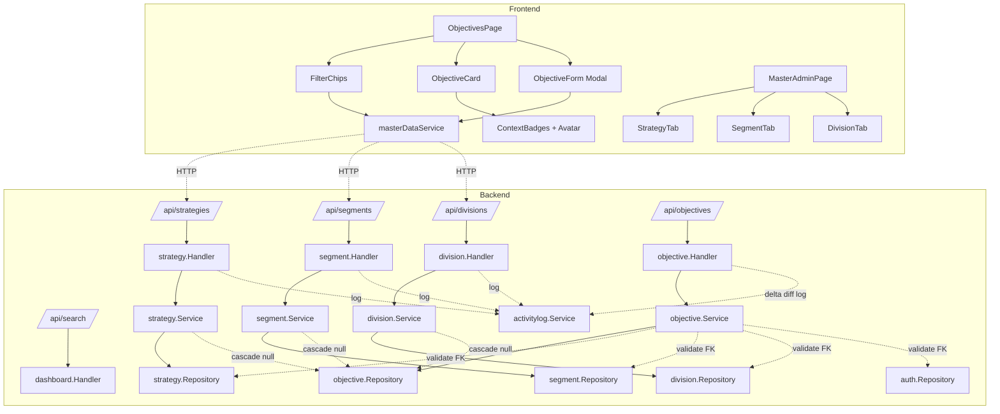
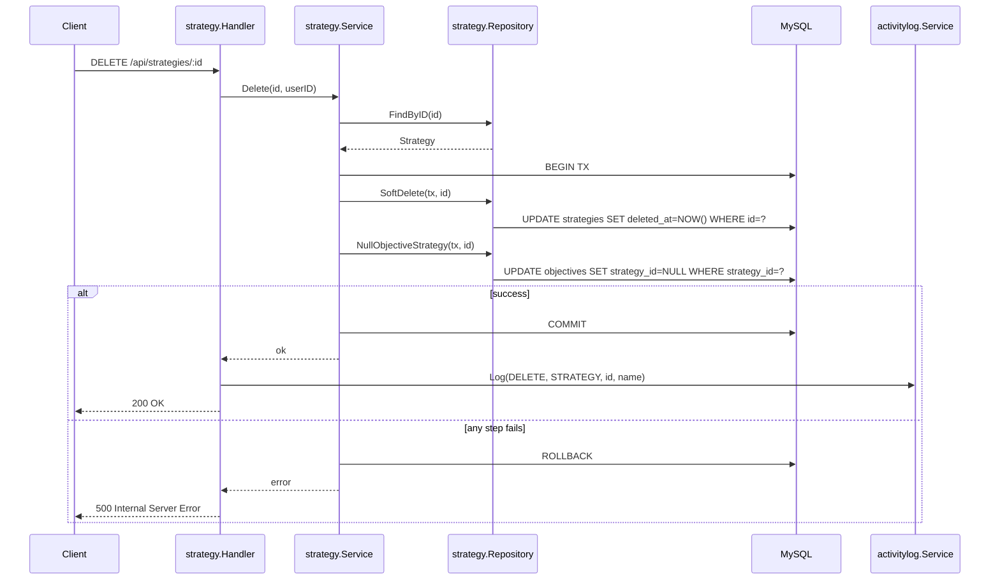
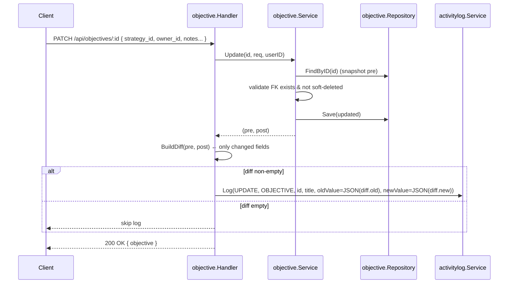

# Design Document

## Overview

Fitur **OKR Objective Context** menambahkan dimensi strategis ke entity Objective pada aplikasi Antares Eazy OKR: setiap Objective dapat dikategorikan ke pillar **Strategy** ("Defend to Scale", "Extend", "Transform"), **Customer Segment** (SME, Enterprise, ...), dan **Division** pelaksana (Product, Developer, GTM, ...), serta memiliki **Owner** (PIC accountable) dan field **Notes** untuk catatan transparan.

Tiga master baru di-CRUD-kan oleh siapa pun yang authenticated (no role lock di MVP). Lima kolom baru pada `objectives` (`strategy_id`, `segment_id`, `division_id`, `owner_id`, `notes`) semua **nullable** sehingga data lama tetap valid (Requirement 13). Filter, search, badge UI, dan filter chip menggunakan ketiga master tersebut. Business rule existing (cascade delete, progress chain, ownership edit/delete tetap di `created_by`, status enum) tidak berubah.

### Goals

1. Memberi konteks strategis (3 sumbu klasifikasi + owner + notes) untuk Objective
2. Master CRUD tanpa role restriction (semua authenticated user)
3. Filter Objective list dengan AND-logic gabungan tiga master
4. Backward compatibility — Objective lama (5 kolom NULL) tetap dapat dibaca, di-edit, dan dihapus
5. Soft delete master tidak menghapus Objective; FK pada Objective di-set NULL secara transaksional
6. Activity log mencatat HANYA field yang berubah (delta diff)

### Non-Goals

- RBAC untuk master CRUD (di luar MVP)
- Multi-select master per Objective (tetap single FK)
- Validasi konsistensi semantik antar master (misal Strategy "Transform" cocok dengan Segment "SME") — bebas
- Modifikasi Key Result / Initiative / Sprint
- Migrasi data Objective lama ke nilai default

## Architecture

### Module Decomposition (Backend)

Mengikuti pattern existing (`handler → service → repository`, satu folder per domain), fitur ini menambahkan **tiga modul terpisah** plus mengubah modul `objective` dan `dashboard`. Pertimbangan memilih tiga modul independen daripada satu modul `master` dengan tiga sub-handler:

- **Tiga modul terpisah** ✅ dipilih — konsisten dengan struktur existing (`auth`, `period`, `sprint`, `objective`, `keyresult`, `initiative`); tiap entity punya schema, validation rule, dan relasi yang berbeda; testability per modul lebih jelas.
- Satu modul `master` ❌ akan menggabungkan tiga skema yang punya kolom unik (`Division.code`, `Strategy.sort_order`); melawan konvensi proyek.

```
backend/internal/modules/
├── strategy/        ← NEW
│   ├── model.go
│   ├── dto.go
│   ├── repository.go
│   ├── service.go
│   └── handler.go
├── segment/         ← NEW (struktur sama)
├── division/        ← NEW (struktur sama)
├── objective/       ← UPDATED: tambah 5 kolom + FK preload + filter
└── dashboard/       ← UPDATED: search.go inject context names
```

Shared utility baru:

```
backend/internal/shared/
├── validation/
│   └── color.go     ← NEW: regex ^#[0-9A-Fa-f]{6}$
└── seeder/
    └── master.go    ← NEW: idempotent seeder dijalankan dari main.go
```

### Component Diagram



### Request Flow — Soft Delete Strategy with Cascade Null



### Request Flow — Update Objective with Delta Diff Activity Log



## Components and Interfaces

### Backend: `strategy` Module

#### Endpoints

| Method | Path                  | Auth | Description                                |
| ------ | --------------------- | ---- | ------------------------------------------ |
| GET    | `/api/strategies`     | ✓    | List active+inactive (deleted_at IS NULL)  |
| POST   | `/api/strategies`     | ✓    | Create                                     |
| GET    | `/api/strategies/:id` | ✓    | Detail                                     |
| PATCH  | `/api/strategies/:id` | ✓    | Update                                     |
| DELETE | `/api/strategies/:id` | ✓    | Soft delete + cascade null `strategy_id`   |

#### `strategy.Handler` Interface

```go
type Handler struct {
    svc       *Service
    actLogger *activitylog.Service
}

func (h *Handler) List(c *gin.Context)    // GET
func (h *Handler) Create(c *gin.Context)  // POST → 201 + log CREATE
func (h *Handler) GetByID(c *gin.Context) // GET /:id
func (h *Handler) Update(c *gin.Context)  // PATCH → log UPDATE diff
func (h *Handler) Delete(c *gin.Context)  // DELETE → log DELETE
```

#### `strategy.Service` Interface

```go
type Service struct {
    repo *Repository
    db   *gorm.DB  // for tx
}

func (s *Service) List() ([]StrategyResponse, error)
func (s *Service) Create(req CreateRequest) (*StrategyResponse, *FieldErrors)
func (s *Service) GetByID(id uint) (*StrategyResponse, error)
func (s *Service) Update(id uint, req UpdateRequest) (*StrategyResponse, *FieldErrors)
func (s *Service) Delete(id uint) error  // tx: soft delete + cascade null
```

`FieldErrors` is `map[string]string` mapped to `errors` field of API response (per backend-rules). On duplicate name → returns `&FieldErrors{"name": "Name already exists"}` and HTTP 422.

#### `strategy.Repository` Interface

```go
func (r *Repository) Create(s *Strategy) error
func (r *Repository) FindByID(id uint) (*Strategy, error)
func (r *Repository) FindAll() ([]Strategy, error)         // ordered by sort_order ASC, LOWER(name) ASC
func (r *Repository) FindByNameCI(name string) (*Strategy, error) // for uniqueness check
func (r *Repository) Update(s *Strategy) error
func (r *Repository) SoftDeleteTx(tx *gorm.DB, id uint) error
func (r *Repository) NullObjectiveStrategyTx(tx *gorm.DB, id uint) error // UPDATE objectives SET strategy_id=NULL WHERE strategy_id=?
```

### Backend: `segment` Module

Same shape as `strategy`, minus `sort_order`. Endpoints `/api/segments`, fields: `id, name, description, color, is_active`. Sort order: `LOWER(name) ASC`. Cascade null sets `objectives.segment_id = NULL`.

### Backend: `division` Module

Same shape as `strategy`, minus `sort_order`, plus required unique field `code` (1-20 chars, case-insensitive unique). Endpoints `/api/divisions`, fields: `id, name, code, description, color, is_active`. Sort order: `LOWER(name) ASC`. Cascade null sets `objectives.division_id = NULL`. Unique check both `name` and `code` (case-insensitive, trimmed).

### Backend: `objective` Module Updates

#### Model Changes

```go
type Objective struct {
    // ... existing fields ...
    StrategyID  *uint  `gorm:"index" json:"strategy_id"`
    SegmentID   *uint  `gorm:"index" json:"segment_id"`
    DivisionID  *uint  `gorm:"index" json:"division_id"`
    OwnerID     *uint  `gorm:"index" json:"owner_id"`
    Notes       *string `gorm:"type:text" json:"notes"`

    // GORM-only relations (preload)
    Strategy *strategy.Strategy `gorm:"foreignKey:StrategyID" json:"-"`
    Segment  *segment.Segment   `gorm:"foreignKey:SegmentID"  json:"-"`
    Division *division.Division `gorm:"foreignKey:DivisionID" json:"-"`
    Owner    *auth.User         `gorm:"foreignKey:OwnerID"    json:"-"`
}
```

To prevent import cycle, the `objective` package will import light-weight read-only structs (or use plain struct embedding via `Preload(...)` returning typed columns). Implementation choice: define minimal embedded structs in `objective/relations.go` that map to the same tables — avoids the cycle.

#### DTO Changes

```go
type CreateRequest struct {
    PeriodID    uint    `json:"period_id" binding:"required"`
    Title       string  `json:"title" binding:"required,max=255"`
    Description string  `json:"description"`
    StrategyID  *uint   `json:"strategy_id"`
    SegmentID   *uint   `json:"segment_id"`
    DivisionID  *uint   `json:"division_id"`
    OwnerID     *uint   `json:"owner_id"`
    Notes       *string `json:"notes" binding:"omitempty,max=5000"`
}

// UpdateRequest distinguishes "absent" vs "explicit null" by using
// json.RawMessage indirection or pointer-to-pointer. Implementation:
type UpdateRequest struct {
    Title       *string                `json:"title"`
    Description *string                `json:"description"`
    Status      *string                `json:"status"`
    StrategyID  PatchableUint          `json:"strategy_id"`
    SegmentID   PatchableUint          `json:"segment_id"`
    DivisionID  PatchableUint          `json:"division_id"`
    OwnerID     PatchableUint          `json:"owner_id"`
    Notes       PatchableString        `json:"notes"`
}

type PatchableUint struct {
    Present bool   // key present in payload
    Value   *uint  // nil = explicit null
}
type PatchableString struct {
    Present bool
    Value   *string
}
```

`PatchableUint` and `PatchableString` implement `UnmarshalJSON` so `{"strategy_id": null}` → `Present=true, Value=nil`, while absent key → `Present=false`. This enables Requirement 5.3 vs 5.5 behavior cleanly.

#### Response Shape

```json
{
  "id": 12,
  "title": "Increase reliability",
  "strategy_id": 1,
  "segment_id": null,
  "division_id": 3,
  "owner_id": 7,
  "notes": "Catatan...",
  "strategy": { "id": 1, "name": "Defend to Scale", "color": "#194FBC" },
  "segment":  null,
  "division": { "id": 3, "name": "Product", "code": "PROD", "color": "#10B981" },
  "owner":    { "id": 7, "name": "Zaky", "email": "zaky@example.com" }
}
```

If FK is non-NULL but the referenced master is soft-deleted, the embedded object SHALL be returned as `null` (orphan handled gracefully — Requirement 13.3, 9.7).

#### Filter Endpoint

`GET /api/objectives?period_id=&page=&limit=&strategy_id=&segment_id=&division_id=`

Service builds GORM query:

```go
q := r.db.Model(&Objective{}).Where("period_id = ?", periodID)
if filter.StrategyID != nil { q = q.Where("strategy_id = ?", *filter.StrategyID) }
if filter.SegmentID  != nil { q = q.Where("segment_id  = ?", *filter.SegmentID)  }
if filter.DivisionID != nil { q = q.Where("division_id = ?", *filter.DivisionID) }
```

All three filters are combined with **AND**. Empty result → HTTP 200 with `data: []`.

### Backend: `dashboard` Module Updates

`search.go` query for objectives extended:

```go
s.db.Table("objectives o").
    Select(`o.id, o.title,
            st.name AS strategy_name,
            sg.name AS segment_name,
            dv.name AS division_name`).
    Joins("LEFT JOIN strategies st ON st.id = o.strategy_id AND st.deleted_at IS NULL").
    Joins("LEFT JOIN segments   sg ON sg.id = o.segment_id  AND sg.deleted_at IS NULL").
    Joins("LEFT JOIN divisions  dv ON dv.id = o.division_id AND dv.deleted_at IS NULL").
    Where("o.title LIKE ? AND o.deleted_at IS NULL", like).
    Limit(5).Find(&rows)
```

`SearchResult` for objective items adds nullable string fields `strategy_name`, `segment_name`, `division_name` (omitted via `,omitempty` for non-objective types).

### Backend: Seeder

`backend/internal/shared/seeder/master.go` exposes:

```go
func SeedMasters(db *gorm.DB) (Summary, error)
type Summary struct { Strategies, Segments, Divisions int }
```

Behavior: per-entity loop, lookup `LOWER(TRIM(name))`; if no live record exists, INSERT inside one TX per entity (rollback on any failure). Idempotent — re-runs do not modify existing records. Hooked from `cmd/api/main.go` after `database.Migrate()`.

### Frontend: Master Admin Page (`/admin/masters`)

```
src/pages/MasterAdminPage.tsx        ← NEW page
src/components/organisms/
  ├── MasterTabs.tsx                 ← tabs Strategy | Segment | Division
  ├── StrategyTable.tsx              ← rows + Edit/Delete
  ├── SegmentTable.tsx
  ├── DivisionTable.tsx
  ├── StrategyFormModal.tsx          ← create/edit modal
  ├── SegmentFormModal.tsx
  ├── DivisionFormModal.tsx
  └── ColorPicker.tsx                ← atomic-friendly color hex input
src/components/atomics/ColorSwatch.tsx ← visual hex preview
src/services/master.service.ts        ← strategiesApi, segmentsApi, divisionsApi
src/types/master.ts                   ← Strategy, Segment, Division interfaces
```

Modal uses `react-hook-form` with field-level validation matching backend rules. On submit: POST/PATCH; on success → `toast.success`, `queryClient.invalidateQueries(['masters', kind])`, close modal. On 4xx/5xx → toast error from `response.message` fallback `"Operasi gagal, silakan coba lagi"`, modal stays open. Delete: `DeleteConfirmDialog` (existing pattern) → DELETE → invalidate.

Route registered in `src/app/router.tsx` under protected layout.

### Frontend: Objective Form Enhancements

`CreateObjectiveModal.tsx` and the matching edit modal are extended:

- Three `Dropdown` atomics for Strategy / Segment / Division populated from `useQuery(['masters','strategies'], ...)` (filtered to `is_active=true`, sorted CI by name); first option is `{ value: null, label: "Tidak dipilih" }`.
- Owner picker — `Dropdown` populated from `GET /api/users` with same null-option pattern.
- `Textarea` atomic for Notes with character counter `{used}/5000`. RHF `register("notes", { maxLength: 5000 })` shows inline error and disables Save when invalid.
- Master fetch failure (5xx or 10s timeout) → inline error chip on the dropdown + dropdown disabled until refetch succeeds.

Submit payload always includes the five new fields. Empty Notes after `trim()` becomes `null`.

### Frontend: Objective Card Enhancements

`ObjectivePanel.tsx` (or `ObjectiveCard.tsx` if extracted) renders:

- `<ContextBadges>` row inside the card header below the title:
  - Strategy badge: full name truncated 30 chars + ellipsis, background = strategy.color (or fallback `#E5E7EB` if invalid hex / soft-deleted / orphan).
  - Segment badge: same rules.
  - Division badge: shows `code`, same rules.
- `<OwnerAvatar>` 32×32 circle in card top-right with 1–2 initials uppercase + tooltip on 500ms hover (name + email). Hidden if `owner_id` NULL or owner soft-deleted.
- A pure utility `getBadgeColor(hex: string | null | undefined): string` returns `hex` if it matches `/^#[0-9A-Fa-f]{6}$/`, else `#E5E7EB`. This is unit-testable in isolation.

### Frontend: Filter Chips on `/objectives`

`<FilterChips>` organism rendered above objective list:

- Three groups (Strategy / Segment / Division), each with a leading `"Semua"` chip + chip per active master (CI sorted by name).
- State stored in `useState` in `ObjectivesPage` (or via URL query string for shareable links).
- `"Semua"` chip → removes that key from query params.
- Single-select per group; cross-group selections combine (AND).
- TanStack Query key includes filter state: `['objectives', { periodId, strategyId, segmentId, divisionId, page }]` — auto refetch on chip change.
- Loading state: skeleton on list area; 5xx/timeout: error block with "Coba lagi" button calling `refetch()`.

### Frontend: Service Layer

```ts
// services/master.service.ts
export const strategiesApi = {
  list:   () => api.get<{data: Strategy[]}>('/strategies').then(r => r.data.data),
  create: (body: CreateStrategyDto) => api.post<{data: Strategy}>('/strategies', body),
  update: (id: number, body: UpdateStrategyDto) => api.patch<{data: Strategy}>(`/strategies/${id}`, body),
  remove: (id: number) => api.delete(`/strategies/${id}`),
};
// segmentsApi, divisionsApi — same shape
```

`objective.service.ts` extended to accept filter + return new fields. `dashboard.service.ts` typed `SearchResult.objective` with `strategy_name | null` etc.

## Data Models

### New Tables

```sql
CREATE TABLE strategies (
  id BIGINT UNSIGNED PRIMARY KEY AUTO_INCREMENT,
  name        VARCHAR(100) NOT NULL,
  description VARCHAR(500) NULL,
  color       CHAR(7)      NOT NULL DEFAULT '#E5E7EB',
  sort_order  INT          NOT NULL DEFAULT 0,
  is_active   BOOLEAN      NOT NULL DEFAULT TRUE,
  created_at  DATETIME,
  updated_at  DATETIME,
  deleted_at  DATETIME     NULL,
  INDEX idx_strategies_deleted_at (deleted_at),
  INDEX idx_strategies_sort_name (sort_order, name)
);

CREATE TABLE segments (
  id BIGINT UNSIGNED PRIMARY KEY AUTO_INCREMENT,
  name        VARCHAR(100) NOT NULL,
  description VARCHAR(500) NULL,
  color       CHAR(7)      NOT NULL DEFAULT '#E5E7EB',
  is_active   BOOLEAN      NOT NULL DEFAULT TRUE,
  created_at  DATETIME,
  updated_at  DATETIME,
  deleted_at  DATETIME     NULL,
  INDEX idx_segments_deleted_at (deleted_at)
);

CREATE TABLE divisions (
  id BIGINT UNSIGNED PRIMARY KEY AUTO_INCREMENT,
  name        VARCHAR(100) NOT NULL,
  code        VARCHAR(20)  NOT NULL,
  description VARCHAR(500) NULL,
  color       CHAR(7)      NOT NULL DEFAULT '#E5E7EB',
  is_active   BOOLEAN      NOT NULL DEFAULT TRUE,
  created_at  DATETIME,
  updated_at  DATETIME,
  deleted_at  DATETIME     NULL,
  INDEX idx_divisions_deleted_at (deleted_at)
);
```

> Uniqueness for `name` (and `code` on divisions) is enforced **in service layer** (case-insensitive on TRIM(name) over live rows), not as a SQL UNIQUE constraint, because soft-deleted rows are allowed to keep their original name and a new live record may reuse the name of a deleted record.

### Altered Table: `objectives`

```sql
ALTER TABLE objectives
  ADD COLUMN strategy_id BIGINT UNSIGNED NULL AFTER status,
  ADD COLUMN segment_id  BIGINT UNSIGNED NULL AFTER strategy_id,
  ADD COLUMN division_id BIGINT UNSIGNED NULL AFTER segment_id,
  ADD COLUMN owner_id    BIGINT UNSIGNED NULL AFTER division_id,
  ADD COLUMN notes       TEXT            NULL AFTER owner_id,
  ADD INDEX idx_objectives_strategy (strategy_id),
  ADD INDEX idx_objectives_segment  (segment_id),
  ADD INDEX idx_objectives_division (division_id),
  ADD INDEX idx_objectives_owner    (owner_id),
  ADD CONSTRAINT fk_obj_strategy FOREIGN KEY (strategy_id) REFERENCES strategies(id),
  ADD CONSTRAINT fk_obj_segment  FOREIGN KEY (segment_id)  REFERENCES segments(id),
  ADD CONSTRAINT fk_obj_division FOREIGN KEY (division_id) REFERENCES divisions(id),
  ADD CONSTRAINT fk_obj_owner    FOREIGN KEY (owner_id)    REFERENCES users(id);
```

GORM AutoMigrate handles ADD COLUMN on existing rows with NULL default (Requirement 13.1). FK constraints are `ON DELETE NO ACTION` — soft delete is application-level cascade.

### Migration Order

Updated migration order (`backend/internal/database/migration.go`):

```
1. users
2. periods
3. strategies   ← NEW
4. segments     ← NEW
5. divisions    ← NEW
6. sprints
7. objectives   (now references strategies/segments/divisions/users)
8. key_results
9. initiatives
10. initiative_updates
11. notifications
12. notification_logs
13. activity_logs
```

### Domain Constants

```go
// backend/internal/shared/validation/color.go
var ColorHexPattern = regexp.MustCompile(`^#[0-9A-Fa-f]{6}$`)
const FallbackColor = "#E5E7EB"
```

### Default Seed Data

| Entity     | Records                                                                                       |
| ---------- | --------------------------------------------------------------------------------------------- |
| Strategies | "Defend to Scale" `#194FBC`, "Extend" `#10B981`, "Transform" `#F59E0B`                        |
| Segments   | "SME" `#3B82F6`, "Enterprise" `#8B5CF6`, "Government" `#EF4444`, "B2B ICT" `#14B8A6`          |
| Divisions  | Product `PROD` `#194FBC`, Developer `DEV` `#10B981`, GTM `GTM` `#F59E0B`, UX `UX` `#EC4899`, Operational `OPS` `#6B7280`, Data `DATA` `#0EA5E9` |


## Correctness Properties

*A property is a characteristic or behavior that should hold true across all valid executions of a system — essentially, a formal statement about what the system should do. Properties serve as the bridge between human-readable specifications and machine-verifiable correctness guarantees.*

After prework analysis (see `prework` tool output) and reflection consolidating overlapping criteria, the following 13 universal properties cover the testable behavior of this feature. Each maps to one or more EARS acceptance criteria.

### Property 1: Master list excludes soft-deleted and is sorted

*For any* set of records in `strategies` / `segments` / `divisions` (mix of live and soft-deleted, arbitrary names and `sort_order`), `GET /api/<masters>` SHALL return exactly the records where `deleted_at IS NULL`, ordered ascending by `sort_order` then ascending by `LOWER(TRIM(name))` for Strategy, or ascending `LOWER(TRIM(name))` for Segment and Division.

**Validates: Requirements 1.1, 2.1, 3.1**

### Property 2: Master CRUD round-trip preserves data

*For any* valid create or update payload (within length bounds and matching Color_Code), `POST` / `PATCH` followed by `GET /api/<masters>/:id` SHALL return a record whose persisted fields equal the submitted payload (after server-side `TRIM` on `name` and `code`), with monotonically increasing `updated_at`.

**Validates: Requirements 1.2, 1.5, 2.2, 2.5, 3.2, 3.6**

### Property 3: Name and Division code uniqueness (CI-trim) is enforced

*For any* candidate `name` whose `LOWER(TRIM(name))` already exists in the live records of the same master entity (excluding the record currently being updated), the create or update request SHALL be rejected with HTTP 422, `errors.name` set, and DB state unchanged. The same property holds for `code` on Division (HTTP 422 with `errors.code`).

**Validates: Requirements 1.3, 2.4, 3.3, 3.4**

### Property 4: Field validity determines HTTP 400 outcome

*For any* create or update payload where (a) `name` length ∉ [1,100] post-trim, OR (b) `code` length ∉ [1,20] post-trim (Division), OR (c) `description` length > 500, OR (d) `color` does not match `^#[0-9A-Fa-f]{6}$`, OR (e) Strategy `sort_order` ∉ [0,9999], OR (f) Objective `notes` length > 5000, OR (g) Objective `strategy_id`/`segment_id`/`division_id`/`owner_id` is non-integer, the request SHALL be rejected with HTTP 400 and `errors.<field>`, and DB state SHALL be unchanged. Conversely, when all such fields are within bounds, the request SHALL NOT be rejected with 400 due to those fields.

**Validates: Requirements 1.4, 2.3, 3.5, 4.5, 5.10, 5.11**

### Property 5: Soft delete cascades null-out and is transactional

*For any* master record `M` with `N ≥ 0` Objectives referencing it via `strategy_id` / `segment_id` / `division_id`, after `DELETE /api/<masters>/:id` returns 200, `M.deleted_at` SHALL be non-null AND every one of those `N` Objectives SHALL have the corresponding FK column set to `NULL`, while all unrelated Objectives remain unchanged. If the cascade transaction fails at any step, the DB state SHALL be identical to the pre-delete state (rollback).

**Validates: Requirements 1.7, 1.8, 2.7, 2.8, 3.8, 3.9**

### Property 6: Invalid Objective FK rejected with 422

*For any* create or update Objective payload where one of `strategy_id` / `segment_id` / `division_id` / `owner_id` references an `id` that does not exist in the corresponding live (non-soft-deleted) master table, the request SHALL be rejected with HTTP 422, `errors.<fk_field>` set, and the Objective record SHALL NOT be created or modified.

**Validates: Requirements 5.6, 5.7, 5.8, 5.9**

### Property 7: PATCH semantics on Objective context fields

*For any* existing Objective `O` and any `UpdateRequest` payload, after `PATCH /api/objectives/:id` succeeds, each field `f ∈ {strategy_id, segment_id, division_id, owner_id, notes}` SHALL satisfy: (a) if `f` is **absent** from the payload key set, `O.f` retains its pre-update value; (b) if `f` is **present** with a non-null value `v`, `O.f == v`; (c) if `f` is **present** with explicit `null`, `O.f` becomes `NULL`.

**Validates: Requirements 5.3, 5.4, 5.5, 13.4**

### Property 8: Multi-filter AND-logic on Objective list

*For any* dataset of Objectives in a given period and any subset `F ⊆ {strategy_id, segment_id, division_id}` of filter parameters with values `v_f`, the response of `GET /api/objectives?period_id=...&<filters>` SHALL contain (a) every Objective `O` where `O.period_id == period_id AND O.deleted_at IS NULL AND ∀f∈F: O.f == v_f`, AND (b) only such Objectives. Single-filter cases are subsumed by `|F|=1`. When the resulting set is empty, response is HTTP 200 with `data: []` and `meta.total = 0`, `meta.total_pages = 0`. Invalid filter values (non-integer, non-positive, or `id` not in master) SHALL produce HTTP 400 with no list query executed.

**Validates: Requirements 6.1, 6.2, 6.3, 6.4, 6.5, 6.6, 6.7**

### Property 9: Embedded master in Objective response equals live master else null

*For any* Objective response (from `GET /api/objectives`, `GET /api/objectives/:id`, or `GET /api/search` for `type=objective`), the embedded field `strategy` / `segment` / `division` / `owner` (or `strategy_name` / `segment_name` / `division_name` for search) SHALL equal the corresponding fields of the referenced master record when `<fk_id> IS NOT NULL` AND the referenced record exists with `deleted_at IS NULL`; otherwise the embedded field SHALL be `null` (and present in the JSON, not omitted). Search results for `type ≠ "objective"` SHALL NOT contain `strategy_name` / `segment_name` / `division_name` keys.

**Validates: Requirements 5.13, 5.14, 7.1, 7.2, 7.3, 7.4, 7.5, 13.3, 13.5**

### Property 10: Card badge color uses fallback for invalid or orphan references

*For any* `hex` input, the pure utility `getBadgeColor(hex: string|null|undefined)` SHALL return `hex` if it matches `^#[0-9A-Fa-f]{6}$`, else the fallback `#E5E7EB`. Furthermore, *for any* Objective rendered by `<ObjectiveCard>`, when `<fk_id> IS NULL` OR the referenced master is soft-deleted/not found, the corresponding badge or avatar SHALL NOT render AND no error SHALL be thrown during render.

**Validates: Requirements 9.1, 9.2, 9.3, 9.4, 9.6, 9.7**

### Property 11: Activity log captures only the diff

*For any* update Objective operation that succeeds, with pre-update snapshot `pre` and post-update record `post`, the resulting `activity_logs` row's `old_value` JSON object SHALL contain exactly the keys `K = {k | pre[k] ≠ post[k]}` with values `pre[k]`, and `new_value` SHALL contain the same keys with values `post[k]`. If `K = ∅` AND no other field of the Objective was modified by the request, no `activity_logs` row SHALL be created. *For any* create Objective with non-null/non-empty new context fields, the `CREATE` log's `new_value` SHALL contain exactly those non-null fields. *For any* failed transaction (rollback), no `activity_logs` row SHALL be created for that operation.

**Validates: Requirements 14.1, 14.2, 14.3, 14.4**

### Property 12: Seeder idempotency

*For any* initial state of `strategies` / `segments` / `divisions` tables, executing the seeder `N ≥ 1` times SHALL produce the same final state as executing it once: (a) for each default record name, exactly one live record exists matched by `LOWER(TRIM(name))`; (b) no field of any pre-existing live record is modified; (c) no live record is deleted. The summary returned SHALL count only the records actually inserted on that invocation.

**Validates: Requirements 12.1, 12.2, 12.3, 12.4, 12.6**

### Property 13: Edit/delete permission depends on created_by only

*For any* user `u` and any Objective `O`, an edit or delete request from `u` SHALL succeed (subject to other validations) if and only if `u.id == O.created_by`, regardless of the value of `O.owner_id`. All other authenticated users receive HTTP 403.

**Validates: Requirements 5.12, 13.6**

## Error Handling

### HTTP Error Mapping

| Condition                                                                    | Status | Body                                                |
| ---------------------------------------------------------------------------- | ------ | --------------------------------------------------- |
| Missing/expired/malformed JWT                                                | 401    | `{success:false, message:"Unauthorized"}`           |
| Validation failure (length, color regex, non-integer FK, oversized notes)    | 400    | `{success:false, message, errors:{<field>:"..."}}`  |
| Duplicate name/code (CI-trim) on master                                      | 422    | `{success:false, message, errors:{name|code}}`      |
| Objective FK references non-existent or soft-deleted master                  | 422    | `{success:false, message, errors:{strategy_id...}}` |
| Update/Delete master with non-existent or soft-deleted id                    | 404    | `{success:false, message:"Not found"}`              |
| Objective edit/delete by non-creator                                         | 403    | `{success:false, message:"Forbidden"}`              |
| Cascade delete TX failure / seeder TX failure / unexpected DB error          | 500    | `{success:false, message:"Internal Server Error"}`  |

### Service Errors

Service layer returns Go errors. Handlers map sentinel errors:

```go
var (
    ErrNotFound       = errors.New("not_found")
    ErrForbidden      = errors.New("forbidden")
    ErrDuplicateName  = errors.New("duplicate_name")
    ErrDuplicateCode  = errors.New("duplicate_code")
    ErrInvalidColor   = errors.New("invalid_color")
    ErrFKNotFound     = errors.New("fk_not_found") // wrap with field name
)
```

Handler maps these to HTTP responses; raw GORM errors are coerced to 500 with sanitized message (no SQL leak).

### Frontend Error UX

| Scenario                              | UX                                                                            |
| ------------------------------------- | ----------------------------------------------------------------------------- |
| Master fetch 5xx / 10s timeout        | Inline error chip on dropdown + dropdown disabled + retry button              |
| Objective list 5xx / timeout          | Block-level error region with "Coba lagi" button calling `refetch()`          |
| Master CRUD 4xx                       | Inline `errors.<field>` mapped under matching form input via RHF `setError`   |
| Master CRUD 5xx or empty `errors`     | Toast `response.message` or fallback `"Operasi gagal, silakan coba lagi"`     |
| Notes > 5000 client-side              | Inline error + Save disabled before submit                                    |
| Orphan/invalid color in card          | Fallback color `#E5E7EB`, render proceeds (no error boundary trigger)         |

### Transaction Boundaries

| Operation                                             | TX scope                                                                    |
| ----------------------------------------------------- | --------------------------------------------------------------------------- |
| `DELETE /api/strategies/:id` (and segments/divisions) | One TX: soft-delete master + null cascade on `objectives.<fk>`              |
| `PATCH /api/objectives/:id` with FK changes           | One TX: validate FK → save Objective → return both pre and post for log    |
| Seeder run                                            | One TX per entity (strategies, segments, divisions) — partial success ok    |
| Schema migration (Requirement 13.1)                   | One TX wrapping all `ALTER TABLE` for new columns and indexes               |

Activity log writes are intentionally outside the request's primary TX (existing pattern) — they fire only after the TX commits successfully.

## Testing Strategy

### Library Selection

| Layer    | Test framework / PBT              |
| -------- | --------------------------------- |
| Backend  | Standard `testing` + `gopter` for property-based tests (Go-native generators, supports shrinking) |
| Frontend | Vitest + `fast-check` for property-based tests on pure utilities and validation/diff functions |

Both libraries integrate with existing CI test runners; no need to implement PBT from scratch.

### Test Categories

#### A. Backend Property Tests (`*_property_test.go`)

Each correctness property maps to **one** property-based test, configured for **min 100 iterations** via `gopter.DefaultTestParameters().MinSuccessfulTests = 100`. Each test is tagged with a Go comment `// Feature: okr-objective-context, Property <n>: <text>` referencing the design property.

| Test file                                              | Property |
| ------------------------------------------------------ | -------- |
| `strategy/list_property_test.go`                       | P1       |
| `strategy/crud_roundtrip_property_test.go`             | P2       |
| `strategy/uniqueness_property_test.go`                 | P3       |
| `strategy/validation_property_test.go`                 | P4       |
| `strategy/cascade_delete_property_test.go`             | P5       |
| `objective/fk_validation_property_test.go`             | P6       |
| `objective/patch_semantics_property_test.go`           | P7       |
| `objective/filter_property_test.go`                    | P8       |
| `objective/embed_relations_property_test.go`           | P9       |
| `objective/activity_diff_property_test.go`             | P11      |
| `objective/permission_property_test.go`                | P13      |
| `seeder/idempotency_property_test.go`                  | P12      |

For Segment and Division, P1–P5 are reused via parametric test suites (a single property body run with three different repository fixtures). Properties run against an isolated SQLite in-memory DB during unit phase and a MySQL test container during integration phase (the former for fast iteration, the latter for soft-delete index correctness).

##### Generators (Gopter)

```go
gen.AlphaString().SuchThat(s => 1 <= len(strings.TrimSpace(s)) <= 100)  // valid name
gen.RegexMatch(`^#[0-9A-Fa-f]{6}$`)                                      // valid color
gen.IntRange(0, 9999)                                                     // sort_order
gen.OneConstOf("", "  ", "abc", "VALID#%@", strings.Repeat("a", 5001))   // mixed validity for notes
gen.SliceOf(genObjective).WithLen(0, 50)                                 // dataset
```

Edge cases covered by generators (per prework EDGE_CASE classifications): empty string, all-whitespace, 5000-boundary, 5001-overflow, mixed casing, unicode whitespace, missing/orphan IDs.

#### B. Backend Example & Integration Tests

| Test                                                      | Type        | Why                                            |
| --------------------------------------------------------- | ----------- | ---------------------------------------------- |
| Auth gating on master endpoints (401)                     | Example     | Behavior fixed by middleware                   |
| Cascade TX rollback under fault injection                 | Example     | Requires fault injection, not input variation  |
| Seeder run summary structure                              | Example     | Single shape verification                      |
| Migration adds nullable columns to existing rows          | Smoke       | One-time schema check                          |
| Objective 200/empty response on no-match filter           | Edge case   | Subsumed by P8 generator producing such inputs |
| WebSocket broadcast still fires on master CUD             | Integration | Verifies hub wiring                            |

#### C. Frontend Property Tests (`*.property.test.ts`)

Pure utility + form-logic properties via `fast-check.assert` with 100 runs. Each tagged `// Feature: okr-objective-context, Property <n>: <text>`.

| Test file                                                 | Property |
| --------------------------------------------------------- | -------- |
| `utils/getBadgeColor.property.test.ts`                    | P10      |
| `utils/getOwnerInitials.property.test.ts`                 | P10      |
| `utils/buildOptions.property.test.ts`                     | (P9-frontend mirror) |
| `utils/buildObjectivePayload.property.test.ts`            | (form payload — covers Req 8.9) |
| `utils/diffObjective.property.test.ts`                    | P11      |
| `utils/filterChipsState.property.test.ts`                 | P8       |

#### D. Frontend Component & E2E Tests

| Test                                                 | Type        |
| ---------------------------------------------------- | ----------- |
| Master Admin Page tab switching, table render        | Component (RTL) |
| Modal validation surfacing per RHF                   | Component   |
| Filter chip click → URL → refetch                    | Component   |
| Notes textarea counter and disabled Save             | Component   |
| Orphan FK Objective renders without error            | Component   |
| Loading skeleton + "Coba lagi" on error              | Example     |
| Master fetch failure inline error in Objective form  | Example     |

### Coverage Mapping

| Requirement      | Covered By           |
| ---------------- | -------------------- |
| 1.1, 2.1, 3.1    | P1 + example tests   |
| 1.2, 1.5, 2.x, 3.x CRUD basics | P2 |
| 1.3, 2.4, 3.3, 3.4 | P3                |
| 1.4, 2.3, 3.5, 4.5, 5.10, 5.11 | P4    |
| 1.7-1.8, 2.7-2.8, 3.8-3.9 | P5 + fault-inject example |
| 4.1-4.4          | Auth example tests   |
| 5.1, 13.1        | Migration smoke test |
| 5.2-5.5, 13.4    | P7                   |
| 5.6-5.9          | P6                   |
| 5.12, 13.6       | P13                  |
| 5.13-5.14, 7.1-7.5, 13.3, 13.5 | P9     |
| 6.1-6.7          | P8                   |
| 6.8              | Existing pagination tests + 1 new example |
| 8.1-8.4, 8.7, 8.9 | Frontend property + component |
| 8.5-8.6, 8.8     | Component tests      |
| 9.1-9.7          | P10 + component      |
| 10.1-10.7, 10.10 | Frontend chip-state property |
| 10.8-10.9        | Component examples   |
| 11.1-11.6, 11.8-11.11 | Component / E2E |
| 11.7             | RHF validation property |
| 12.1-12.6        | P12 + example for summary + fault-inject example |
| 13.2             | Migration fault-inject example |
| 14.1-14.3        | P11                  |
| 14.4             | Fault-inject example |

### Property Test Configuration

```go
// gopter
parameters := gopter.DefaultTestParameters()
parameters.MinSuccessfulTests = 100
parameters.MaxShrinkCount = 50
properties := gopter.NewProperties(parameters)
```

```ts
// fast-check
fc.assert(fc.property(...), { numRuns: 100, verbose: true });
```

Each property test runs against a clean DB transaction (rolled back at end of test) to avoid cross-test contamination. Frontend property tests are pure-function (no DOM or network).

### Continuous Verification

- All property + example + smoke tests run on every PR via existing CI.
- Migration smoke test runs against a fresh MySQL container to verify schema delta on existing data.
- Seeder idempotency test re-runs the seeder twice in CI and asserts row counts are stable.
