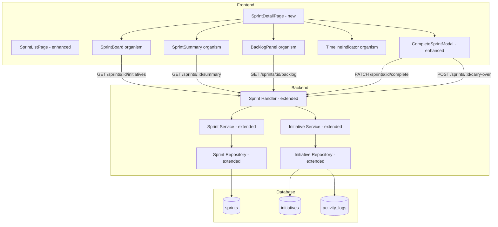
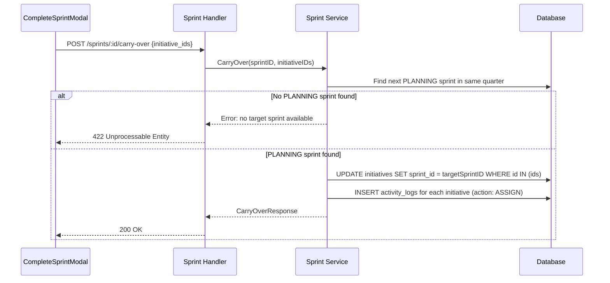

# Design Document: Sprint Workflow Improvement

## Overview

This feature transforms the Sprint page from a simple list view into a comprehensive sprint workflow hub. It adds a Sprint Detail Page with an initiative board grouped by status, sprint progress summary, lifecycle actions (activate/complete with carry-over), a backlog view for unassigned initiatives, and a timeline indicator for active sprints.

The design leverages the existing backend module architecture (handler → service → repository) and frontend patterns (TanStack Query, Zustand, atomic design components). New backend endpoints provide sprint-scoped initiative data, backlog queries, and carry-over logic. The frontend introduces a new `SprintDetailPage` and several new organism components.

## Architecture



## Components and Interfaces

### Backend — New/Modified Endpoints

| Method | Path | Description |
|--------|------|-------------|
| GET | `/api/sprints/:id/initiatives` | Get all initiatives for a sprint, grouped by status, with parent objective/KR context |
| GET | `/api/sprints/:id/summary` | Get sprint progress summary (counts, average progress) |
| GET | `/api/sprints/:id/backlog` | Get unassigned initiatives for the sprint's quarter |
| POST | `/api/sprints/:id/carry-over` | Carry over selected incomplete initiatives to next PLANNING sprint |
| PATCH | `/api/initiatives/:id/assign-sprint` | Assign a backlog initiative to a sprint |

### Backend — DTOs

```go
// Sprint Initiative Response (with parent context)
type SprintInitiativeResponse struct {
    ID              uint      `json:"id"`
    KeyResultID     uint      `json:"key_result_id"`
    SprintID        *uint     `json:"sprint_id"`
    ParentID        *uint     `json:"parent_id"`
    Title           string    `json:"title"`
    Description     *string   `json:"description"`
    AssigneeID      *uint     `json:"assignee_id"`
    AssigneeName    *string   `json:"assignee_name"`
    Progress        float64   `json:"progress"`
    Status          string    `json:"status"`
    DueDate         *string   `json:"due_date"`
    ObjectiveTitle  string    `json:"objective_title"`
    KeyResultTitle  string    `json:"key_result_title"`
    CreatedBy       uint      `json:"created_by"`
}

// Sprint Summary Response
type SprintSummaryResponse struct {
    TotalInitiatives  int     `json:"total_initiatives"`
    TodoCount         int     `json:"todo_count"`
    InProgressCount   int     `json:"in_progress_count"`
    BlockedCount      int     `json:"blocked_count"`
    DoneCount         int     `json:"done_count"`
    CancelledCount    int     `json:"cancelled_count"`
    SprintProgress    float64 `json:"sprint_progress"`
}

// Carry Over Request
type CarryOverRequest struct {
    InitiativeIDs []uint `json:"initiative_ids" binding:"required"`
}

// Carry Over Response
type CarryOverResponse struct {
    CarriedCount    int    `json:"carried_count"`
    TargetSprintID  uint   `json:"target_sprint_id"`
    TargetSprintName string `json:"target_sprint_name"`
}

// Assign Sprint Request
type AssignSprintRequest struct {
    SprintID uint `json:"sprint_id" binding:"required"`
}
```

### Frontend — New Components

| Component | Type | Location | Description |
|-----------|------|----------|-------------|
| SprintDetailPage | Page | `pages/SprintDetailPage.tsx` | Main sprint detail page with board, summary, backlog |
| SprintBoard | Organism | `components/organisms/SprintBoard.tsx` | Initiatives grouped by status columns |
| SprintSummary | Organism | `components/organisms/SprintSummary.tsx` | Aggregate stats and progress bar |
| BacklogPanel | Organism | `components/organisms/BacklogPanel.tsx` | Unassigned initiatives list with assign action |
| TimelineIndicator | Organism | `components/organisms/TimelineIndicator.tsx` | Days elapsed/remaining bar |
| CompleteSprintModal | Organism | `components/organisms/CompleteSprintModal.tsx` | Enhanced modal with carry-over section |
| InitiativeCard | Organism | `components/organisms/InitiativeCard.tsx` | Card for sprint board with context breadcrumbs |

### Frontend — New Services

```typescript
// sprint.service.ts additions
export const getSprintInitiatives = (sprintId: number) =>
  api.get(`/sprints/${sprintId}/initiatives`);

export const getSprintSummary = (sprintId: number) =>
  api.get(`/sprints/${sprintId}/summary`);

export const getSprintBacklog = (sprintId: number) =>
  api.get(`/sprints/${sprintId}/backlog`);

export const carryOverInitiatives = (sprintId: number, data: { initiative_ids: number[] }) =>
  api.post(`/sprints/${sprintId}/carry-over`, data);

export const assignInitiativeToSprint = (initiativeId: number, data: { sprint_id: number }) =>
  api.patch(`/initiatives/${initiativeId}/assign-sprint`, data);
```

### Frontend — New Types

```typescript
interface SprintInitiative {
  id: number;
  key_result_id: number;
  sprint_id: number | null;
  parent_id: number | null;
  title: string;
  description: string | null;
  assignee_id: number | null;
  assignee_name: string | null;
  progress: number;
  status: string;
  due_date: string | null;
  objective_title: string;
  key_result_title: string;
  created_by: number;
}

interface SprintSummary {
  total_initiatives: number;
  todo_count: number;
  in_progress_count: number;
  blocked_count: number;
  done_count: number;
  cancelled_count: number;
  sprint_progress: number;
}

interface CarryOverResponse {
  carried_count: number;
  target_sprint_id: number;
  target_sprint_name: string;
}
```

## Data Models

No new database tables are needed. The feature uses existing tables (`sprints`, `initiatives`, `activity_logs`) with new query patterns:

### New Queries

1. **Sprint Initiatives with Context** — JOIN initiatives with key_results, objectives, and users to get parent context and assignee name for a given sprint_id.

2. **Sprint Summary** — Aggregate COUNT grouped by status, plus AVG of progress for root-level initiatives (parent_id IS NULL) in a sprint.

3. **Backlog Query** — SELECT initiatives WHERE sprint_id IS NULL AND key_result_id belongs to an objective in the same period_id as the sprint.

4. **Next PLANNING Sprint** — SELECT sprint WHERE period_id = current sprint's period_id AND status = 'PLANNING' ORDER BY start_date ASC LIMIT 1.

### Data Flow — Carry Over



### Data Flow — Sprint Progress Calculation

Sprint progress is NOT stored in the database (no schema change needed). It is computed on-the-fly by the `GET /sprints/:id/summary` endpoint:

```
SprintProgress = AVG(progress) of all root-level initiatives (parent_id IS NULL) in the sprint
```

This keeps the data model simple and avoids sync issues.

## Correctness Properties

*A property is a characteristic or behavior that should hold true across all valid executions of a system — essentially, a formal statement about what the system should do. Properties serve as the bridge between human-readable specifications and machine-verifiable correctness guarantees.*

### Property 1: Initiative grouping partitions by status

*For any* set of initiatives assigned to a sprint, grouping them by status SHALL produce exactly one group per unique status present, and every initiative SHALL appear in exactly the group matching its status. The sum of all group sizes SHALL equal the total initiative count.

**Validates: Requirements 1.2, 2.1**

### Property 2: Sprint progress equals average of root-level initiative progress

*For any* sprint with N root-level initiatives (parent_id IS NULL, N > 0), the sprint progress SHALL equal the arithmetic mean of their progress values. For a sprint with zero initiatives, the progress SHALL be 0.

**Validates: Requirements 2.2**

### Property 3: Backlog contains only unassigned initiatives in the quarter

*For any* sprint's period, the backlog query SHALL return exactly those initiatives where sprint_id IS NULL and the initiative belongs to a key result under an objective in the same period. No initiative with a non-null sprint_id SHALL appear in the backlog.

**Validates: Requirements 4.1**

### Property 4: Assign-to-sprint correctly updates sprint_id

*For any* initiative with sprint_id = NULL and a valid target sprint, calling assign-to-sprint SHALL result in the initiative's sprint_id being set to the target sprint's ID, with no other initiative fields modified.

**Validates: Requirements 4.3**

### Property 5: Incomplete initiative filter excludes DONE and CANCELLED

*For any* set of initiatives in a sprint, the incomplete filter SHALL return exactly those initiatives whose status is NOT equal to "DONE" AND NOT equal to "CANCELLED". The result set SHALL be a proper subset or equal to the input set.

**Validates: Requirements 5.1**

### Property 6: Carry-over reassigns initiatives to next PLANNING sprint

*For any* set of selected initiative IDs and a valid target PLANNING sprint in the same quarter, carry-over SHALL update each initiative's sprint_id to the target sprint's ID, and SHALL create one activity log entry per carried initiative with action "ASSIGN".

**Validates: Requirements 5.2, 5.4**

### Property 7: Sprint list sorting invariant

*For any* list of sprints, sorting SHALL produce an ordering where: all ACTIVE sprints appear before all PLANNING sprints, all PLANNING sprints appear before all COMPLETED sprints, PLANNING sprints are ordered by start_date ascending, and COMPLETED sprints are ordered by end_date descending.

**Validates: Requirements 6.4**

### Property 8: Sprint timeline calculation consistency

*For any* active sprint with start_date and end_date, and any current_date between start_date and end_date (inclusive), the timeline calculation SHALL satisfy: days_elapsed + days_remaining = total_duration, and elapsed_percentage = (days_elapsed / total_duration) × 100.

**Validates: Requirements 8.1, 8.2**

### Property 9: Overdue detection

*For any* sprint with status ACTIVE and current_date > end_date, the system SHALL flag the sprint as overdue and the days_overdue SHALL equal (current_date - end_date) in days, which must be a positive integer.

**Validates: Requirements 8.3**

### Property 10: Progress recalculation chain integrity

*For any* leaf initiative progress update, the parent initiative's progress SHALL equal the average of its direct children's progress (excluding CANCELLED), the key result's progress SHALL equal the average of its root initiatives' progress, and the objective's progress SHALL equal the average of its key results' progress.

**Validates: Requirements 7.3**

## Error Handling

| Scenario | HTTP Status | Message |
|----------|-------------|---------|
| Sprint not found | 404 | "sprint not found" |
| Initiative not found | 404 | "initiative not found" |
| No PLANNING sprint for carry-over | 422 | "no target sprint available for carry-over in this quarter" |
| Sprint is not ACTIVE (on complete) | 422 | "only ACTIVE sprints can be completed" |
| Initiative already assigned to sprint | 422 | "initiative is already assigned to a sprint" |
| Invalid sprint ID in path | 400 | "Invalid sprint ID" |
| Empty initiative_ids in carry-over | 400 | "initiative_ids is required" |
| User not owner/assignee (assign) | 403 | "forbidden" |
| Sprint COMPLETED, cannot assign | 422 | "cannot assign initiatives to a completed sprint" |

### Frontend Error Handling

- API errors displayed via `toast.error(message)`
- Loading states use `<Spinner />` component
- Empty states show descriptive messages with action guidance
- WebSocket disconnect shows reconnection toast
- Optimistic updates with rollback on mutation failure

## Testing Strategy

### Unit Tests (Example-Based)

- Sprint Detail Page renders header with correct sprint data (3.1, 3.2, 3.4, 3.5)
- Initiative Card renders breadcrumbs when parent context is available (1.4)
- Empty state renders when sprint has zero initiatives (1.5)
- Complete Sprint modal opens with review/retro fields (3.3)
- Backlog items display all required fields (4.2)
- Sprint card click triggers navigation (6.2)
- Active sprint has distinct visual styling (6.3)
- Edit drawer opens on initiative card click (7.1)

### Property-Based Tests

Property-based testing is appropriate here because the core logic involves pure functions (grouping, filtering, sorting, arithmetic calculations) with clear universal properties.

**Library:** [fast-check](https://github.com/dubzzz/fast-check) for frontend TypeScript logic, Go standard `testing/quick` or [rapid](https://github.com/flyingmutant/rapid) for backend Go logic.

**Configuration:** Minimum 100 iterations per property test.

**Tag format:** `Feature: sprint-workflow-improvement, Property {N}: {title}`

Properties to implement:
1. Initiative grouping partitions by status
2. Sprint progress = average of root initiatives
3. Backlog filter correctness
4. Assign-to-sprint updates sprint_id
5. Incomplete initiative filter
6. Carry-over reassigns + logs
7. Sprint list sorting invariant
8. Timeline calculation consistency
9. Overdue detection
10. Progress recalculation chain

### Integration Tests

- WebSocket invalidation on initiative progress update (2.3)
- Sprint board reflects status change after drawer update (7.2)
- Full carry-over flow: complete sprint → carry over → verify target sprint has initiatives
- Assign from backlog → verify initiative appears in sprint board

### Edge Cases (Covered by Property Generators)

- Sprint with 0 initiatives (progress = 0)
- All initiatives DONE/CANCELLED (empty carry-over list)
- Sprint with only 1 initiative
- Sprint start_date = end_date (single day sprint)
- Overdue by 0 days (current_date = end_date + 1)
- Initiative with no assignee (null assignee_name in card)
